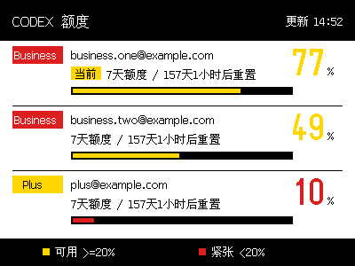
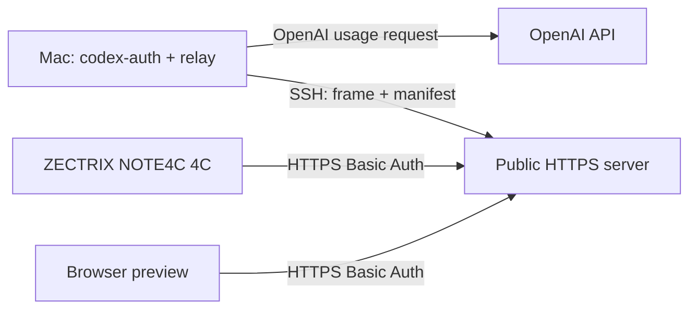

# NOTE4C Codex Quota Dashboard

[简体中文](README.zh-CN.md)

A self-hosted, multi-account Codex quota dashboard for the **ZECTRIX NOTE4C four-color (BWRY) e-paper device**.

The NOTE4C never talks to OpenAI. A Mac sequentially refreshes paid accounts from local `codex-auth` snapshots, renders a 400×300 four-color frame, and publishes only the rendered frame plus a small manifest to your HTTPS server. The device polls that server and refreshes the panel only when the frame revision changes.

## Highlights

- Fixed three-account layout for Business and Plus plans; Free accounts are ignored.
- Marks the account selected by `codex-auth` as the current account.
- Yellow quota at 20% or above, red below 20%.
- Workday quarter-hour scheduling and registry-change updates on macOS.
- Failed refreshes never replace the last successful frame.
- SHA-256 verified, content-addressed 30,000-byte BWRY frames.
- Separate SSH publishing and HTTPS read-only credentials.
- Optional local account labels prevent email addresses from reaching the server.

## Architecture

The server has no Codex or OpenAI token and makes no OpenAI request.

## Prerequisites

- A ZECTRIX NOTE4C **4C** device: ESP32-S3 N16R8 with the 400×300 SSD2683 BWRY panel.
- macOS with the Codex CLI accounts already added.
- The third-party [`codex-auth`](https://github.com/Loongphy/codex-auth) CLI. This project was tested with `codex-auth 0.2.10` and Node.js 24; Node.js 22.21+ is recommended by its API-refresh documentation.
- Rust 1.85 or newer to build the relay.
- A VPS or other public server reachable from the Mac over SSH and from NOTE4C over HTTPS.
- A publicly trusted TLS certificate. A DNS name is the simplest option. A bare public IP also works only when its certificate is valid for that IP and trusted by the ESP-IDF CA bundle.
- ESP-IDF 6.0.2 and a data-capable USB cable to build and flash the firmware patch.

## Start here

The complete setup guide is in [README.zh-CN.md](README.zh-CN.md). Firmware patching and flashing are documented in [docs/firmware.zh-CN.md](docs/firmware.zh-CN.md).

This repository does not contain prebuilt firmware, account tokens, server credentials, real email addresses, or a real deployment address.

## Upstream and license

The relay is inspired by [`BarryBarrywu/codex-zectrix-dashboard`](https://github.com/BarryBarrywu/codex-zectrix-dashboard). The firmware patch targets [`LazyYoun/youn-ink-fourcolor-firmware`](https://github.com/LazyYoun/youn-ink-fourcolor-firmware) at commit `23f5e341cb1f7ccf26bb96f2bad13d192beef5df`. All three projects use the MIT License; see [THIRD_PARTY_NOTICES.md](THIRD_PARTY_NOTICES.md).

Codex and OpenAI are trademarks of their respective owners. This community project is not affiliated with or endorsed by OpenAI, ZECTRIX, `codex-auth`, or the upstream firmware authors.
