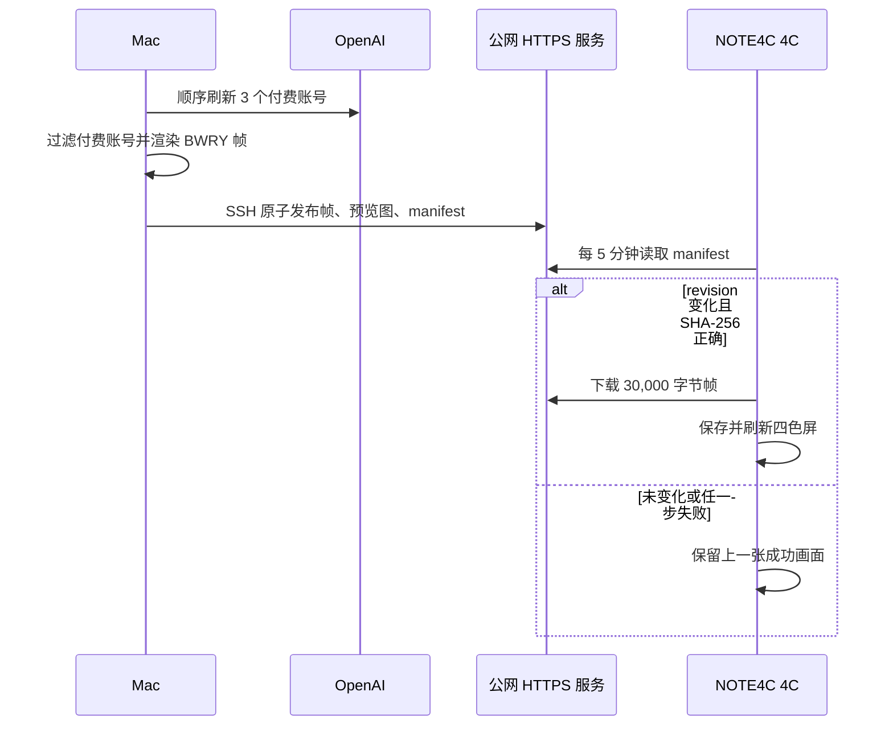

# NOTE4C Codex 多账号额度看板

这是一个面向 **ZECTRIX NOTE4C 4C 四色墨水屏**的自托管 Codex 额度看板。它固定显示 3 个 Business / Plus 账号的 5 小时与周额度，忽略 Free 账号，并标记 `codex-auth` 当前选中的账号。


> 图片中的账号均为虚构示例，不来自真实部署。

## 它解决什么问题

NOTE4C 无法直接访问 OpenAI API，也不适合保存 Codex 登录令牌。本项目把链路拆成三段：

1. Mac 使用 `codex-auth` 管理的本地认证快照，顺序刷新 3 个付费账号的额度；
2. Rust relay 在本地生成 400×300、30,000 字节的 BWRY 2bpp 画面，再通过 SSH 发布到你的公网服务器；
3. NOTE4C 只通过 HTTPS 读取 manifest 和新画面，SHA-256 校验成功后才覆盖旧画面。

服务器不持有 Codex/OpenAI 令牌，也不会访问 OpenAI。

## 前置条件

| 项目 | 要求 |
| --- | --- |
| 设备 | ZECTRIX NOTE4C **4C**，ESP32-S3 N16R8，400×300 SSD2683 BWRY 四色屏 |
| Mac | 已安装并登录 Codex CLI；定时任务只在 Mac 醒着时运行 |
| 多账号工具 | 第三方 [`codex-auth`](https://github.com/Loongphy/codex-auth)，本项目测试版本为 0.2.10 |
| Node.js | 22.21+ 或 24.x；`codex-auth` 的 API 刷新需要较新的 Node.js |
| Relay 构建 | Rust 1.85+，以及 `ssh`、`scp` |
| 公网服务 | 任意可从 Mac 和 NOTE4C 访问的 VPS/静态 HTTPS 主机；22 用于 SSH 发布，80/443 用于签发证书和 HTTPS 读取 |
| TLS | NOTE4C 只接受 HTTPS，证书必须能被 ESP-IDF CA bundle 信任；推荐使用域名和正常的 443 端口 |
| 固件构建 | ESP-IDF 6.0.2、Python 3、可传数据的 USB 线 |

`codex-auth` 是独立的第三方项目，并非本仓库自带。安装与添加账号：

```bash
npm install -g @openai/codex @loongphy/codex-auth
codex-auth login
codex-auth list --api
```

请先确认 `codex-auth list --api` 能显示 3 个 Business / Plus 账号。账号注册表通常位于：

```text
~/.codex/accounts/registry.json
```

## 数据流和刷新规则



- 工作日 08:30–17:15：在 `:00`、`:15`、`:30`、`:45` 尝试刷新。
- 其他时间和周末：整点尝试刷新。
- Mac 休眠时不会主动运行；唤醒后由后续调度或注册表变化继续同步。
- 手工执行 `codex-auth list --api` 会更新注册表，文件监听任务随后发布新画面。
- 顺序刷新器会为每个付费账号单独重试；任一账号最终没有取得实时成功响应时，relay 退出且不覆盖服务器上的 manifest。
- 每个账号左半段显示 5 小时剩余百分比、重置倒计时和进度条，右半段显示周剩余百分比、重置倒计时和进度条。
- 5 小时或周额度任一窗口缺失、过期或字段无效时都拒绝发布，继续保留上一张成功画面。
- NOTE4C 默认每 5 分钟检查一次，但只有 revision 改变才全刷墨水屏。

## 1. 构建 relay

```bash
git clone https://github.com/yewenkai/note4c-codex-quota-dashboard.git
cd note4c-codex-quota-dashboard/relay
cargo build --release
```

可以先用仓库内的虚构 fixture 生成预览：

```bash
./target/release/codex-note4c-relay preview \
  --registry tests/fixtures/registry.sample.json \
  --output-bin /tmp/note4c-quota.bin \
  --output-png /tmp/note4c-quota.png \
  --generated-at 1786431600
```

`--generated-at` 只用于让虚构 fixture 和文档图片可重复生成；真实同步始终使用当前时间。

## 2. 准备公网服务器

详细命令见 [docs/deployment.zh-CN.md](docs/deployment.zh-CN.md)。服务器需要提供：

- `/manifest.json`：禁止缓存；
- `/frames/<sha256>.bin`：可长期缓存；
- `/preview.png` 和 `/`：供浏览器查看；
- 全站 HTTPS Basic Auth；
- `/srv/note4c/public`：由独立的 `note4c-publisher` SSH 用户写入。

推荐为服务器准备域名，例如 `quota.example.com`，并只在安全组开放必要端口。没有域名时，也可以使用固定公网 IP，但必须取得“证书主体就是该 IP”的公开受信任证书；自签名证书不能被当前固件接受。如果 HTTPS 使用非标准端口，设备的 `base_url` 中要显式写端口。

## 3. 配置 Mac 发布

复制配置模板：

```bash
mkdir -p "$HOME/Library/Application Support/note4c-codex-quota"
cp deploy/macos/note4c-sync.example.json \
  "$HOME/Library/Application Support/note4c-codex-quota/note4c-sync.json"
cp relay/target/release/codex-note4c-relay \
  "$HOME/Library/Application Support/note4c-codex-quota/"
cp deploy/macos/note4c-scheduled-sync.sh \
  "$HOME/Library/Application Support/note4c-codex-quota/"
cp deploy/macos/codex-auth-sequential-refresh.mjs \
  "$HOME/Library/Application Support/note4c-codex-quota/"
```

编辑 `note4c-sync.json`，替换绝对路径、顺序刷新器路径、服务器地址和 SSH 私钥。顺序刷新器读取 `codex-auth` 管理的本地认证快照，只在 Mac 上逐个刷新 3 个付费账号；全部成功后才原子更新注册表。模板中的 `accountLabels` 是可选项：

```json
"accountLabels": {
  "your-real-email@example.com": "Business A"
}
```

不设置别名时会直接把邮箱渲染进 PNG/BWRY 画面；设置别名后，公网服务器和设备画面只看到别名。真实配置文件已被 `.gitignore` 排除，不要提交。

首次手工同步：

```bash
install -m 0755 deploy/macos/note4c-quota-refresh \
  "$(brew --prefix)/bin/note4c-quota-refresh"
note4c-quota-refresh
```

这个命令会等待其他同步结束，强制顺序刷新本地额度并立即上传。命令返回成功后，NOTE4C 会在下一次 5 分钟轮询时自动拉取新 revision。

然后按 [docs/deployment.zh-CN.md](docs/deployment.zh-CN.md) 安装两个 LaunchAgent。

## 4. 编译和刷入 4C 固件

本仓库不重新分发完整上游固件，只提供针对固定上游提交的补丁。这样可以清楚保留上游来源，也便于审查本项目究竟改了什么。

完整命令见 [docs/firmware.zh-CN.md](docs/firmware.zh-CN.md)。核心步骤：

```bash
git clone https://github.com/LazyYoun/youn-ink-fourcolor-firmware.git
cd youn-ink-fourcolor-firmware
git checkout 23f5e341cb1f7ccf26bb96f2bad13d192beef5df
git apply /path/to/note4c-codex-quota-dashboard/firmware/patches/0001-note4c-4c-codex-quota-dashboard.patch
cd firmware
idf.py set-target esp32s3
idf.py build
idf.py -p /dev/cu.usbmodemXXXX flash monitor
```

该补丁只面向 NOTE4C 4C，不承诺兼容 NOTE4 黑白版或其他 ESP32 墨水屏。

## 5. 配置设备并进入额度界面

NOTE4C 和电脑处于同一可信局域网时，写入只读服务配置：

```bash
curl -X POST "http://NOTE4C_LAN_IP/settings" \
  -H 'Content-Type: application/json' \
  --data '{
    "codex_dashboard": {
      "enabled": true,
      "base_url": "https://quota.example.com",
      "username": "note4c",
      "password": "YOUR_RANDOM_READ_ONLY_PASSWORD",
      "poll_minutes": 5
    }
  }'
```

配置成功且网络可用时，固件会立即同步并自动进入保留图片 `codexquota` 的全屏页面。此后每次成功发布新 revision，设备都会在下一次轮询时自动覆盖并显示。浏览器访问 `https://quota.example.com/`，输入同一组只读用户名和密码，也能看到同步预览。

## 安全边界

- Codex 登录令牌只留在 Mac 的 `~/.codex`，不会上传到服务器或设备。
- Mac 到服务器使用独立 SSH 发布密钥；不要使用 root 密钥做定时发布。
- NOTE4C 与浏览器只使用独立、随机、只读的 Basic Auth 凭据，且必须配合 HTTPS。
- 服务器会保存已渲染的账号标签、额度和更新时间。若不希望服务器看到邮箱，请配置 `accountLabels`。
- NOTE4C 的局域网设置接口不返回密码，但应只在可信局域网中使用。
- 不要把 `note4c-sync.json`、`.env`、SSH 私钥、设备密码、`sdkconfig` 或真实截图提交到 Git。

更多说明见 [SECURITY.md](SECURITY.md)。

## 项目来源与许可

Relay 的设计受 [`BarryBarrywu/codex-zectrix-dashboard`](https://github.com/BarryBarrywu/codex-zectrix-dashboard) 启发；固件补丁基于 [`LazyYoun/youn-ink-fourcolor-firmware`](https://github.com/LazyYoun/youn-ink-fourcolor-firmware) 的固定提交。许可证和归属见 [THIRD_PARTY_NOTICES.md](THIRD_PARTY_NOTICES.md)。

本项目与 OpenAI、ZECTRIX、`codex-auth` 及上游固件作者没有隶属或官方背书关系。
